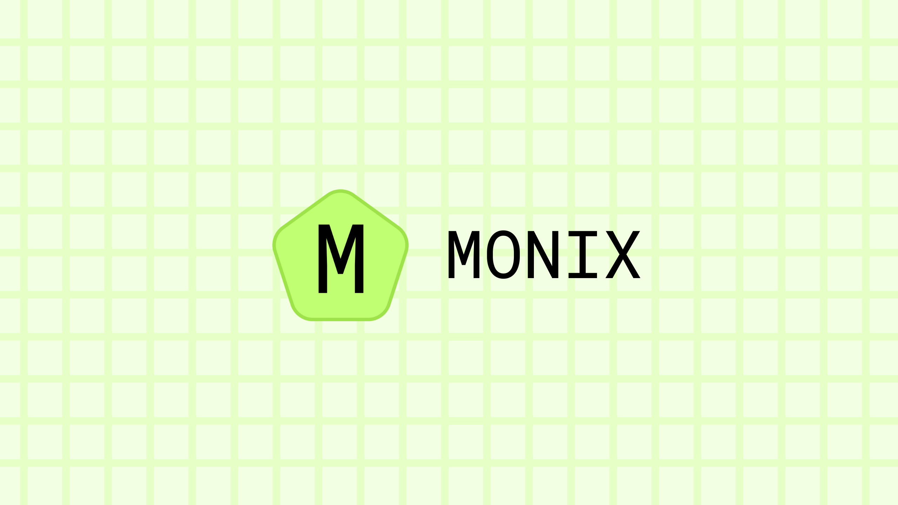

<h1 align="center">Monix</h1>

Monix is a addictive, calming economy game where you buy, sell, and invest your way to the top!

## Development Setup

To setup a local development environment, first fork your own copy of this repository and clone it:

```bash
git clone https://github.com/your-username/monix.git
cd monix
```

Also, setup a git branch to work on and initialize the pre-commit hooks:

```bash
git branch "my-amazing-feature"

npx husky install
npx husky add .husky/pre-commit "npx lint-staged"
```

Next, install the dependencies for the client and server:

```bash
npm install
cd server && npm install && cd ..
```

You can now work on Monix and contribute your changes by opening a pull request.

## Attributions

Emojis provided by Twemoji (<https://github.com/jdecked/twemoji>) under the CC-BY 4.0 License (<https://creativecommons.org/licenses/by/4.0/>)

Icons provided by Tabler Icons (<https://tabler-icons.io/>) under the MIT License (<https://opensource.org/licenses/MIT>)

Music provided by Ferretosan Music (<https://music.ferretosan.com/> & <https://ferretosan.bandcamp.com>) under the license specified in the `src/assets/music` directory.

Some other assets obtained from public domain sources.

This application is not affiliated with or endorsed by any of the original asset creators. However, we are affiliated with Ferretosan Music.

All rights reserved by their respective owners.

## License

Monix is licensed under the MIT License. See `LICENSE`.

Some other licenses apply to specific parts of the source code.
If a directory has other licensing applied, the directory will contain a `LICENSE` file, in the case of that, that LICENSE shall take priority over the project's MIT license.

## Contact

You can contact me with general inquires at <me@proplayer919.dev>
You can use <legal@proplayer919.dev> for legal inquires.

## Policies

To view the Terms of Service, Privacy Policy, Community Guidelines, Automated Moderation Disclaimer and other policies, go to the `policies` folder of this repository or visit the website at <https://monix-policies.proplayer919.dev>
